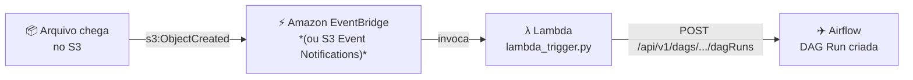
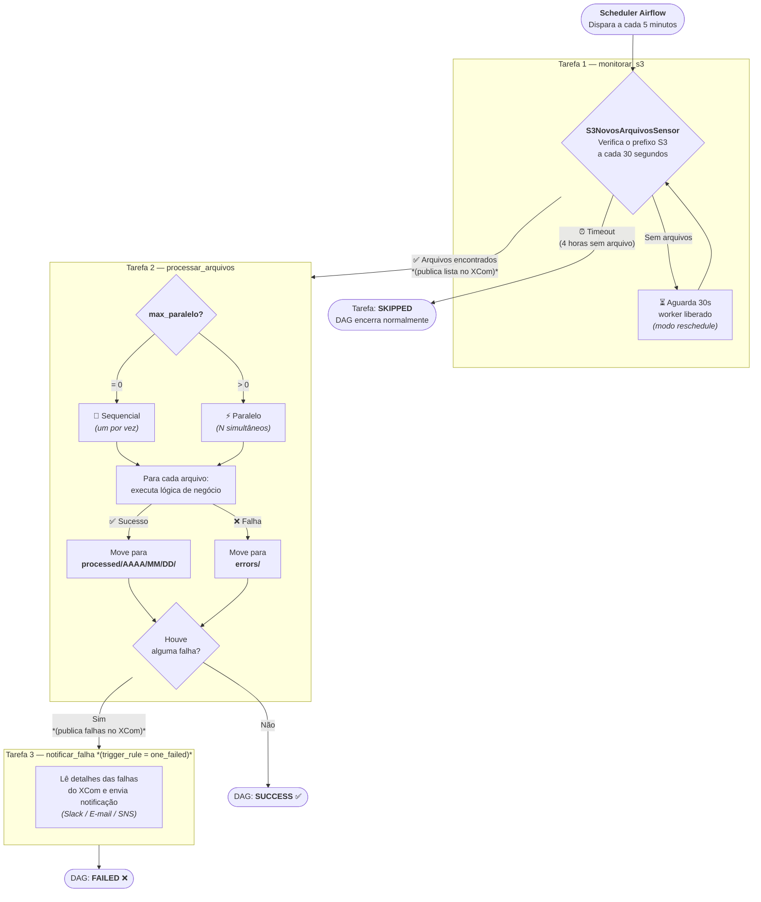
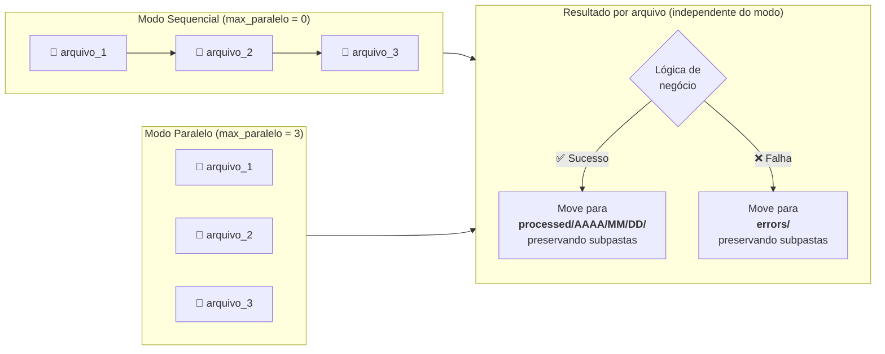
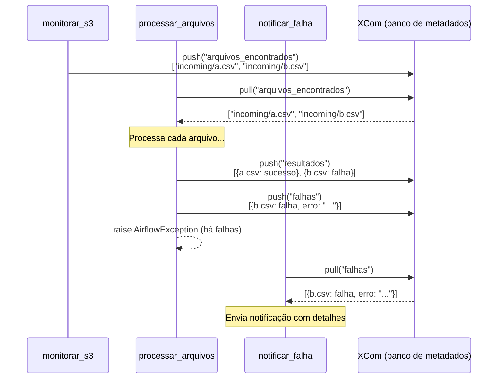

# Arquitetura — S3 Monitor DAG

Este documento descreve a arquitetura técnica da solução, seus componentes,
decisões de design e comportamentos em cada cenário de execução.

---

## 0. Modelo Event-Driven vs Polling

### Por que não usar polling para arquivos mensais

O `S3KeySensor` e o `S3PrefixSensor` nativos do Airflow usam **polling**: ficam
verificando o S3 periodicamente e falham quando o timeout expira sem arquivo.
Para arquivos mensais, isso gera **falsos alertas de FAILED** — o arquivo não chegou
porque ainda não é a hora, não porque houve erro.

Nossa solução usa um **sensor customizado com `soft_fail=True`**, o que converte
timeout em SKIPPED (sem alerta). Mas polling com `schedule_interval` curto ainda
gera dezenas de execuções desnecessárias por mês.

### Solução adotada: Event-Driven

A DAG tem `schedule_interval=None` — **não roda por agendamento**. Ela só é
disparada quando um arquivo realmente chega no S3:



| | Polling | Event-Driven |
|---|---------|--------------|
| Execuções/mês (arquivo mensal) | ~180 | **1** |
| Latência de detecção | até 5 min | **segundos** |
| Falsos alertas de FAILED | possível (S3KeySensor padrão) | **impossível** |
| Ruído operacional (SKIPPED) | alto | **zero** |
| Infraestrutura adicional | nenhuma | EventBridge + Lambda |

### Quando usar polling mesmo assim

Se não for possível configurar EventBridge/Lambda, use polling com frequência
adequada à janela esperada:

```python
# Para arquivos mensais — polling como fallback
schedule_interval = "@daily"         # 30 execuções/mês (vs 8.640 com 5 min)
timeout           = 60 * 60 * 23     # 23 horas por run
soft_fail         = True             # timeout → SKIPPED, não FAILED
```

---

---

## 1. Visão Geral do Fluxo



---

## 2. Processamento por Arquivo



> **Falha parcial:** se `arquivo_1` falha e `arquivo_2` tem sucesso,
> cada um vai para seu destino correto. A tarefa é marcada como FAILED
> para acionar a notificação, mas `arquivo_2` já foi movido para `processed/`.

---

## 3. Estrutura de Pastas no S3

```
bucket-s3/
│
├── incoming/                          ← Prefixo monitorado
│   │
│   ├── relatorio_vendas.csv           ← Arquivo na raiz do prefixo
│   │
│   └── financeiro/                    ← Subpasta
│       ├── jan_2024.parquet
│       └── fev_2024.parquet
│
├── processed/                         ← Destino: arquivos com SUCESSO
│   └── 2024/
│       ├── 01/
│       │   └── 15/                    ← Partição por data de execução
│       │       ├── relatorio_vendas.csv
│       │       └── financeiro/        ← Estrutura de subpastas preservada
│       │           └── jan_2024.parquet
│       └── 02/
│           └── 03/
│               └── financeiro/
│                   └── fev_2024.parquet
│
└── errors/                            ← Destino: arquivos com FALHA
    ├── relatorio_vendas.csv           ← Sem partição por data
    └── financeiro/
        └── jan_2024.parquet
```

### Regras de mapeamento de caminhos

| Origem | Resultado | Destino |
|--------|-----------|---------|
| `incoming/arquivo.csv` | ✅ Sucesso (2024-01-15) | `processed/2024/01/15/arquivo.csv` |
| `incoming/pasta/arquivo.csv` | ✅ Sucesso (2024-01-15) | `processed/2024/01/15/pasta/arquivo.csv` |
| `incoming/a/b/c/arquivo.parquet` | ✅ Sucesso (2024-01-15) | `processed/2024/01/15/a/b/c/arquivo.parquet` |
| `incoming/arquivo.csv` | ❌ Falha | `errors/arquivo.csv` |
| `incoming/pasta/arquivo.csv` | ❌ Falha | `errors/pasta/arquivo.csv` |

---

## 4. Comunicação entre Tarefas (XCom)

O Airflow usa XCom (cross-communication) para passar dados entre tarefas.
Os dados ficam armazenados no banco de metadados do Airflow.



---

## 5. Comportamentos em Cenários Especiais

### Cenário A — Nenhum arquivo chega em 4 horas
```
monitorar_s3 → SKIPPED (soft_fail=True)
processar_arquivos → não executa (upstream skipped)
notificar_falha    → não executa
DAG Run: SUCCESS (comportamento esperado)
```

### Cenário B — Todos os arquivos processados com sucesso
```
monitorar_s3       → SUCCESS (publica lista no XCom)
processar_arquivos → SUCCESS (todos movidos para processed/AAAA/MM/DD/)
notificar_falha    → SKIPPED (nenhum upstream falhou)
DAG Run: SUCCESS
```

### Cenário C — Falha parcial (alguns arquivos ok, outros falham)
```
monitorar_s3       → SUCCESS
processar_arquivos → FAILED (levanta AirflowException)
                     ├── arquivo_ok.csv   → processed/AAAA/MM/DD/arquivo_ok.csv
                     └── arquivo_err.csv  → errors/arquivo_err.csv
notificar_falha    → SUCCESS (envia notificação com detalhes de arquivo_err.csv)
DAG Run: FAILED
```

### Cenário D — Todos os arquivos falham
```
monitorar_s3       → SUCCESS
processar_arquivos → FAILED
                     ├── arquivo_1.csv → errors/arquivo_1.csv
                     └── arquivo_2.csv → errors/arquivo_2.csv
notificar_falha    → SUCCESS (envia notificação com ambos os arquivos)
DAG Run: FAILED
```

### Cenário E — Execução simultânea bloqueada
```
max_active_runs=1 garante que apenas uma instância da DAG rode por vez.
Se uma execução está em andamento quando o scheduler dispara a próxima,
a nova execução fica em estado "queued" até a atual terminar.
Isso evita que dois processos detectem e processem os mesmos arquivos.
```

---

## 6. Decisões de Design

| Decisão | Alternativas consideradas | Motivo da escolha |
|---------|--------------------------|-------------------|
| `mode="reschedule"` no sensor | `mode="poke"` | Não ocupa slot de worker entre verificações; essencial em ambientes com poucos workers |
| `soft_fail=True` no sensor | `soft_fail=False` (padrão) | Timeout sem arquivos é comportamento esperado, não um erro; evita alertas falsos |
| Move dentro de `_processar_um_arquivo` | Move em tarefas separadas | Permite falha parcial: cada arquivo tem seu destino decidido independentemente |
| `logical_date` para partição de data | `datetime.now()` | Garante consistência em reprocessamentos e backfills |
| `max_active_runs=1` | Sem limite | Previne condição de corrida onde duas execuções processam o mesmo arquivo |
| `ThreadPoolExecutor` para paralelo | Celery workers, DAG dinâmica | Simples, sem dependências extras; adequado para I/O bound (S3, APIs) |
| Erros sem partição por data | Mesmo padrão dos processados | Facilita localização manual para reprocessamento |

---

## 7. Pontos de Extensão

### 7.1 Lógica de negócio
Localização: [`dags/s3_monitor_dag.py`](../dags/s3_monitor_dag.py), função `_processar_um_arquivo()`, bloco `INÍCIO DA LÓGICA DE NEGÓCIO`.

### 7.2 Canal de notificação
Localização: [`dags/s3_monitor_dag.py`](../dags/s3_monitor_dag.py), função `notificar_falha()`, bloco `INÍCIO DOS CANAIS DE NOTIFICAÇÃO`.

Canais pré-configurados (descomente o desejado):
- **Slack**: via `SlackWebhookHook` (provider: `apache-airflow-providers-slack`)
- **E-mail**: via `send_email` do Airflow (requer configuração SMTP)
- **AWS SNS**: via `SnsHook` (já incluso no provider Amazon)

### 7.3 Frequência de monitoramento
- Frequência da DAG: `schedule_interval` na definição da DAG (padrão: 5 min)
- Frequência do sensor: `poke_interval` na instância do sensor (padrão: 30s)
- Timeout do sensor: `timeout` na instância do sensor (padrão: 4h)
