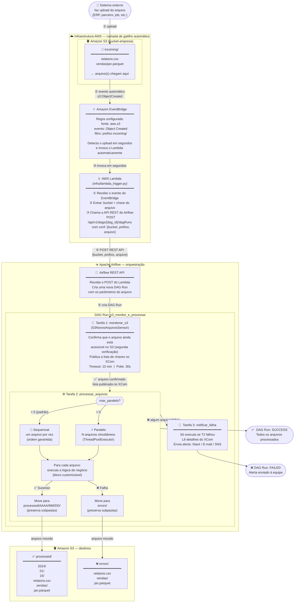

# Fluxo Completo — S3 Monitor

Este documento explica **de onde a execução começa até onde termina**, passando
por cada serviço AWS e cada tarefa do Airflow.

---

## Diagrama Completo (ponta a ponta)



---

## Explicação Passo a Passo

### Passo ① — Upload do arquivo no S3

Um sistema externo (ERP, job de exportação, parceiro comercial, processo manual)
faz o upload de um ou mais arquivos na pasta `incoming/` do bucket S3.

```
s3://bucket-empresa/incoming/relatorio.csv
s3://bucket-empresa/incoming/vendas/jan.parquet   ← subpasta: também detectado
```

Não há nenhuma ação manual necessária a partir daqui. Todo o restante é automático.

---

### Passo ② — Amazon S3 emite um evento automático

No momento em que o arquivo é gravado no bucket, o S3 emite automaticamente um
evento do tipo `Object Created`. Esse é um comportamento nativo do S3 — não
requer nenhum código.

```json
{
  "source": "aws.s3",
  "detail-type": "Object Created",
  "detail": {
    "bucket": { "name": "bucket-empresa" },
    "object": { "key": "incoming/relatorio.csv" }
  }
}
```

> **Configuração necessária:** nas propriedades do bucket S3, habilitar
> *"Send notifications to Amazon EventBridge"*.

---

### Passo ③ — Amazon EventBridge detecta o evento e invoca o Lambda

O EventBridge é o **roteador de eventos** da AWS. Ele recebe o evento do S3
e verifica se ele bate com alguma regra configurada.

A regra que criamos filtra especificamente:
- Fonte: `aws.s3`
- Tipo: `Object Created`
- Bucket: `bucket-empresa`
- Prefixo do objeto: `incoming/`

Quando o evento bate com essa regra, o EventBridge **invoca automaticamente**
a função Lambda em milissegundos.

> **Configuração necessária:** criar uma regra no Amazon EventBridge apontando
> para a função Lambda como destino.

---

### Passo ④ — Lambda extrai as informações e chama o Airflow

A função Lambda (`infra/lambda_trigger.py`) executa três ações:

**a) Extrai o bucket e a chave do arquivo** a partir do evento recebido:
```python
bucket = "bucket-empresa"
chave  = "incoming/relatorio.csv"
```

**b) Monta a configuração** que será passada para a DAG:
```python
conf = {
    "bucket":             "bucket-empresa",
    "prefixo_monitorado": "incoming/",
    "padrao_arquivo":     "relatorio.csv",   # nome exato do arquivo
    "aws_conn_id":        "aws_default",
}
```

**c) Faz um POST na REST API do Airflow:**
```
POST https://airflow.empresa.com/api/v1/dags/s3_monitor_e_processar/dagRuns

{
  "dag_run_id": "s3_trigger__incoming_relatorio_csv__20240115T143022Z",
  "conf": { ... configuração acima ... }
}
```

O `dag_run_id` é único por arquivo + timestamp, o que garante que **dois uploads
do mesmo arquivo em momentos diferentes gerem duas execuções separadas** (e não
uma sobrescrevendo a outra).

> **Configuração necessária:** variáveis de ambiente do Lambda:
> `AIRFLOW_BASE_URL`, `AIRFLOW_USERNAME`, `AIRFLOW_PASSWORD`, `AIRFLOW_DAG_ID`.

---

### Passo ⑤ — Airflow recebe a chamada e cria a DAG Run

A REST API do Airflow registra a DAG Run no banco de metadados. O Scheduler
a pega e começa a executar as tarefas em sequência.

A `conf` enviada pelo Lambda é acessível dentro de cada tarefa via
`context["params"]`, assim as tarefas sabem exatamente qual arquivo processar.

---

### Tarefa 1 — `monitorar_s3` (Sensor)

O sensor verifica no S3 se o arquivo **ainda está acessível**. Essa é uma
segunda confirmação de segurança — o Lambda já sabe que o arquivo existe,
mas o sensor garante que está disponível para leitura antes de começar o
processamento.

- Se encontrar: publica a lista de chaves no XCom e libera a próxima tarefa
- Se não encontrar em 10 minutos: falha (arquivo sumiu — isso é um erro real)

---

### Tarefa 2 — `processar_arquivos`

Para cada arquivo da lista (obtida do XCom do sensor):

1. Executa a **lógica de negócio** (bloco customizável no código)
2. **Se sucesso:** move o arquivo para `processed/AAAA/MM/DD/` com a data da execução
3. **Se falha:** move para `errors/` e registra o erro

Os arquivos são processados de forma **independente** — a falha de um não
impede o processamento dos outros.

| Parâmetro | Valor | Comportamento |
|-----------|-------|---------------|
| `max_paralelo = 0` | padrão | Sequencial: um por vez, ordem garantida |
| `max_paralelo = 4` | exemplo | Paralelo: 4 arquivos simultâneos |

---

### Tarefa 3 — `notificar_falha`

Executada **somente** se a Tarefa 2 levantou uma exceção (algum arquivo falhou).

Lê do XCom a lista detalhada de falhas e envia uma notificação com:
- Nome da DAG e Run ID
- Quais arquivos falharam
- Qual foi o erro de cada um

Configure o canal desejado no código (Slack, e-mail ou SNS).

---

## Resumo Visual do Caminho do Arquivo

```
UPLOAD                        PROCESSAMENTO                    RESULTADO
──────                        ─────────────                    ─────────

incoming/                     Lógica de        ✅ Sucesso →   processed/
  relatorio.csv  ──────────►  negócio      ──►               2024/01/15/
  vendas/                     (customizável)                    relatorio.csv
    jan.parquet                                                  vendas/
                                                                   jan.parquet

                                             ❌ Falha   →   errors/
                                                              relatorio.csv
                                                              vendas/
                                                                jan.parquet
```

---

## O que precisa ser configurado na AWS

| Serviço | O que configurar | Onde |
|---------|-----------------|------|
| S3 | Habilitar envio de eventos para EventBridge | Properties → Amazon EventBridge → Enable |
| EventBridge | Criar regra com filtro `incoming/` apontando para o Lambda | EventBridge → Rules → Create rule |
| Lambda | Fazer deploy de `infra/lambda_trigger.py` com as variáveis de ambiente | Lambda → Functions → Create function |
| Lambda | Variáveis: `AIRFLOW_BASE_URL`, `AIRFLOW_DAG_ID`, `AIRFLOW_USERNAME`, `AIRFLOW_PASSWORD` | Lambda → Configuration → Environment variables |
| IAM | Criar execution role para o Lambda com permissão `s3:GetObject` e `s3:ListBucket` | IAM → Roles |
| Airflow | Criar conexão `aws_default` | Admin → Connections |
| Airflow | Criar variáveis `s3_bucket`, `s3_monitor_prefix`, etc. | Admin → Variables |

---

## Por que não há `schedule_interval` na DAG

A DAG tem `schedule_interval=None`, o que significa que ela **nunca roda
por agendamento de tempo**. Ela só executa quando o Lambda faz o POST na API.

Isso é intencional e resolve os dois problemas levantados pela equipe:

| Problema | Causa | Solução |
|----------|-------|---------|
| FAILED por timeout | Sensor aguarda arquivo que não chega → timeout → FAILED | DAG só é chamada quando arquivo já chegou |
| Ruído de SKIPPED | Sensor expira todo dia sem arquivo → SKIPPED acumula | Sem execuções agendadas: zero SKIPPED |
